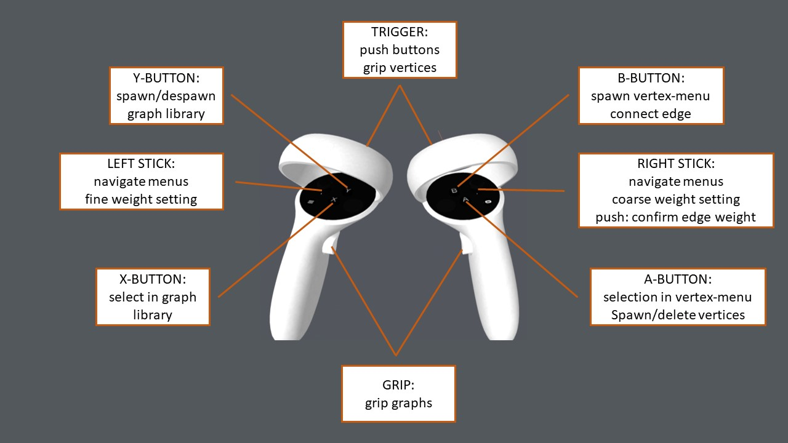
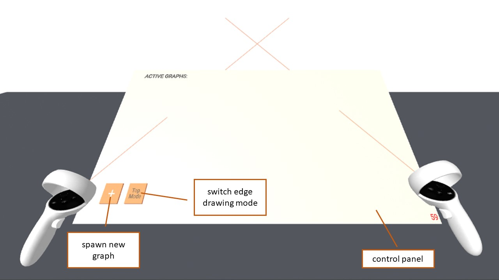
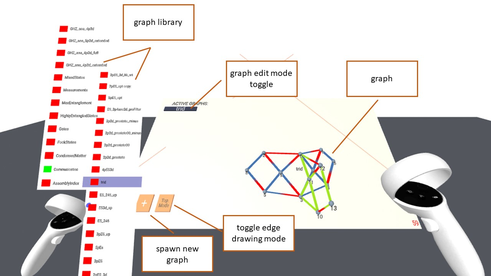
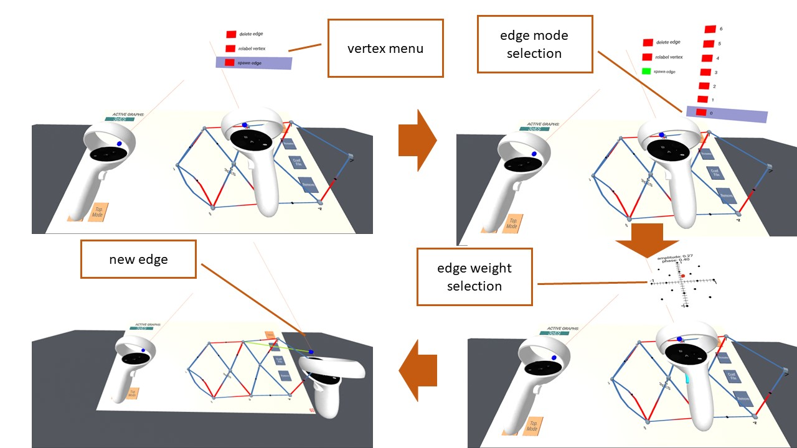

# VRiadne

## Description

VRiadne is VR environment to analyse and manipulate [PyTheus](https://github.com/artificial-scientist-lab/PyTheus) graphs in VR using the [A-frame](<https://aframe.io>) WebVR-framework.
The tool allows free exploration of colored graphs representing quantum optics experiments.
See the corresponding [preprint] for more information.

## Dependencies

Besides the core A-Frame library VRiadne uses a few open-source A-Frame components imported as browser files in [index.html](index.html)

1. [super-hands](https://github.com/c-frame/aframe-super-hands-component) (for gesture controls)
2. [aframe-physics-system](https://github.com/n5ro/aframe-physics-system) (for proper constraints for super-hands)
3. [aframe-physics-extras](https://github.com/wmurphyrd/aframe-physics-extras) (for colliders and collision filters)
4. [aframe-super-keyboard](https://github.com/supermedium/aframe-super-keyboard) (for a keyboard)
5. [aframe-fps-counter-component](https://github.com/supermedium/superframe/tree/master/components/fps-counter/) (for an fps counter)

To run correctly an active internet connection is therefore required.
If this is not desired, these components need to be made available locally.

## How to Use

### Example

Example instance found under .
Compatible with the Oculus Quest 2. Use on other headsets will require adjustment of the control scheme in the source code.
</br>

### Self-Hosting

Modifying the available graphs will require self-hosting of the Website, e.g. by a cloning the Repo and setting up your own GitHub Pages.</br>

#### Adding PyTheus Graphs

To add a PyTheus discovered graph, rename the specific graph-file of the search to start with `plot` and then run the [jsonConv.py](/lib/jsonConv.py)-skript with appropriate arguments. This will compute an initial 3D-layout and modify the appropriate files for the graph to be added to the VR-tool on the next session.

#### Adding any Graph

To add any graph, a JSON-file containing extended graph information needs to be placed in `/processedJSON/<category>/` with a corresponding entry in [index.json](/processedJSON/index.json). For PyTheus Graphs this is done automatically by the [jsonConv.py](/lib/jsonConv.py)-skript.
A template for the graph file is given below:

```json
    {
"graph": {
    "vertices": [
        {
            "id": 0,
            "position": [-0.05, 0, 0],
            "geometry": "sphere", //supports cube, sphere and tetrahedron
            "edges": [0], //array of edges linking to the vertex,
            "neighbours": [1] //neighbours of the vertex
        },
        {
            "id": 1,
            "position": [0.05, 0, 0],
            "geometry": "sphere",
            "edges": [0],
            "neighbours": [0]
    }
    ],
    "edges": [
    {
        "id": 0,
        "config": [0, 1, 1, 1], // [vertex 1, vertex 2, color 1, color 2]
        "amplitude": 1.0,
        "phase": 0.0,
        "siblingConfig": [
            0, //number of siblings (i.e. edges sharing both vertices)
            0, //sibling index
            [] //array of siblings
        ]
    }
    ],
    "target_state": [
    //optional
    "11"
    ],
    "num_anc": 0
}
}
```

### Control Scheme


Button mapping of the VR-Graph-Inspector on Quest 2 controllers, some functionality is conditional on the current inspector state. </br>

### User Interface


Initial UI without any spawned graphs:
Empty control panel with two buttons allowing for spawning of a new graphs, and the toggle for switching the edge drawing mode to colorless edges, just defining graph topology.
</br>
</br>
</br>

By spawning the graph library menu via press of the Y-button and selecting a graph, it's 3D-model is constructed centered on the position of the right-hand controller.
At the top of the control-panel, a new button will spawn bearing the name of the selected graph, controlling whether the corresponding graph can be edited.
</br>
</br>
</br>

Upon pressing the graph edit toggle, a movable dataslate will spawn to the left of the user containing the buttons for spawning the current perfect matchings of the graph. If available, the original target state of the AI-search is displayed as well.</br>
On the right hand side of the control panel four new buttons will appear.
Pressing "Save" will spawn a keyboard upon which a filename can be entered. Doing so will download a graph file in the format of the library files of the current graph configuration.
"Rename" also spawns a keyboard to change the name of the graph.
"ConfFile" will allow the user to enter a task description and then download a template for a search instruction file for PyTheus, restricting the initial graph to the current graph.
"Remove" will despawn the graph and all associated elements.

### Graph Editing

When the edit toggle is pressed, the current graph can be edited with the following actions:

1. Pressing the A-button on the right-hand controller will delete a vertex or spawn a new one, depending on if the controller is hovering over a vertex or not.
2. Pressing the B-button while hovering over a vertex will spawn a vertex menu, allowing deletion of attached edges, relabeling of the vertex, or spawning of a new edge.

Selecting any of the options, will spawn a sub-menu for selecting the edge to be deleted, the new label, or allow specifying the new edges colors.
The latter will only appear if the "topMode" toggle is off, otherwise a black edge is immediately spawned.</br>
After selecting the two colors of th edge, the weight is selected via moving a red indicator sphere on an euler surface. Using the right stick will snapp the indicator to the polar coordinate grid, using the left allows free adjustment. Confirming the weight requires pressing the right stick.
This will spawn the fully defined edge, connected to the controller and to the vertex initially selected.
Pressing the B-button while hovering over a different vertex will connect the edge.
Upon which the output state is re-computed.

