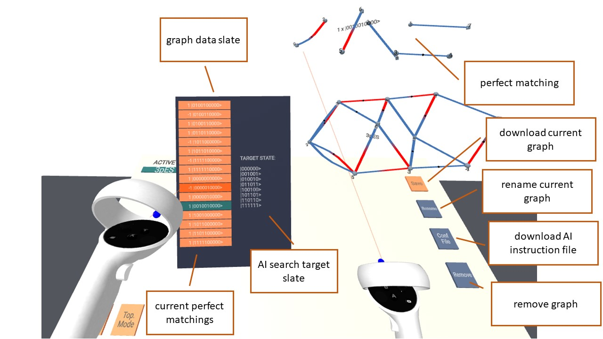

# AriadneVR

## Description

AriadneVR is VR environment to analyse and manipulate [PyTheus](https://github.com/artificial-scientist-lab/PyTheus) graphs in VR using the [A-frame](<https://aframe.io>) WebVR-framework.
In its current form it is compatible with an Oculus Quest 2.
To try it out vist our [instance](https://artificial-scientist-lab.github.io/AriadneVR/).
The tool allows free exploration of colored graphs representing quantum optics experiments.
See the corresponding [preprint]() for more information.

## Dependencies

Besides the core A-Frame library AriadneVR uses a few open-source A-Frame components as well as the math.js library imported as browser files in [vr_env_standalone.html](/vr_env_standalone.html)

1. [super-hands](https://github.com/c-frame/aframe-super-hands-component) (for gesture controls)
2. [math.js](https://github.com/josdejong/mathjs) (for complex numbers)
3. [aframe-physics-system](https://github.com/n5ro/aframe-physics-system) (for proper constraints for super-hands)
4. [aframe-physics-extras](https://github.com/wmurphyrd/aframe-physics-extras) (for colliders and collision filters)
5. [aframe-super-keyboard](https://github.com/supermedium/aframe-super-keyboard) (for a keyboard)
6. [aframe-fps-counter-component](https://github.com/supermedium/superframe/tree/master/components/fps-counter/) (for an fps counter in VR)

To run correctly an active internet connection is therefore required.
If this is not desired, these components need to be made available locally.
AriadneVR also uses the [Line](/https://github.com/mrdoob/three.js/tree/dev/examples/jsm/lines) addon from [THREE.js](https://github.com/mrdoob/three.js) which isn't included in the THREE.js version shipping with A-Frame.
This addon is included in the code with minimal changes [here](./src/lines/).

## Setup & Installation

As a WebVR experience, AriadneVR does not require installation. To try it out simply visit our hosted [instance](https://artificial-scientist-lab.github.io/AriadneVR/) in the browser.</br>
For full customizability, i.e. adding custom graphs, access to the host platform is required, hence we recommend setting up your own instance, either locally or on the Web via e.g. [GitHub Pages](https://docs.github.com/en/pages).
For more options see the [A-Frame documentation](https://aframe.io/docs/1.4.0/introduction/hosting-and-publishing.html) on the topic.
The barebone html-site is given with [vr_env_standalone.html](./vr_env_standalone.html).
To work correctly all files included in its header must be made available.

### Files

The HTML page setting up the tool is given [here](/vr_env_standalone.html).</br>
The source code is given in the [/src](/src/) folder and contains the line addon as well as the custom
A-Frame components:

1. [edge.js](/src/components/edge.js) Component for displaying edge geometries and their changes
2. [graph-editor.js](./src/components/graph-editor.js) Component for enabling a controller to change graphs.
3. [graph-library.js](./src/components/graph-library.js) Component for spawning graphs
4. [graph.js](./src/components/graph.js) Component for constructing graph models and storing the graph state
5. [perfect-matching.js](./src/components/perfect-matching.js) Component for displaying perfect matchings.
6. [user-interface.js](./src/components/user-interface.js) Collection of components for the UI, buttons, controller menus and the control-panel.
7. [vertex.js](./src/components/vertex.js) Component for vertices

In addition the [/lib](./lib/) folder contains relevant helper scripts:

1. [jsonConv.py](/lib/jsonConv.py) Python script for converting PyTheus output.
2. [helpers.js](/lib/helpers.js) JS-port of the PyTheus perfect matching algorithm and minor helper functions used by some source components.

Graph files are placed in a category folder in [/processedJSON/](./processedJSON/).

## How to Use

### Example

[Example](https://artificial-scientist-lab.github.io/AriadneVR/).
Compatible with the Oculus Quest 2. Use on other headsets will require adjustment of the control scheme in the source code.
</br>

#### Adding PyTheus Graphs

PyTheus is not required to run AriadneVR or its preprocessing script.
We use the [igraph](https://igraph.org/) python library to compute initial layouts.
To add a PyTheus discovered graph, rename the desired graph-file in the PyTheus output folder to begin with `plot` and run the [jsonConv.py](/lib/jsonConv.py)-script with appropriate paths as arguments. This will compute an initial 3D layout and modify the appropriate files for the graph to be added to the VR-tool on the next session. The graph is then added to the [/processedJSON/](/processedJSON/) folder in the specified category.

#### Adding any Graph

To add any graph, a JSON file containing extended graph information needs to be placed in `/processedJSON/<category>/` with a corresponding entry in [index.json](/processedJSON/index.json). For PyTheus Graphs this is done by the [jsonConv.py](/lib/jsonConv.py)-script.
A template for the graph file is given below:

```json
    {
"graph": {
    "vertices": [
        {
            "id": 0,
            "position": [-0.05, 0, 0],
            "geometry": "sphere", //supports cube, sphere and tetrahedron
            "edges": [0], //array of edges linking to the vertex,
            "neighbours": [1] //neighbours of the vertex
        },
        {
            "id": 1,
            "position": [0.05, 0, 0],
            "geometry": "sphere",
            "edges": [0],
            "neighbours": [0]
    }
    ],
    "edges": [
    {
        "id": 0,
        "config": [0, 1, 1, 1], // [vertex 1, vertex 2, color 1, color 2]
        "amplitude": 1.0,
        "phase": 0.0,
        "siblingConfig": [
            0, //number of siblings (i.e. edges sharing both vertices)
            0, //sibling index
            [] //array of siblings
        ]
    }
    ],
    "target_state": [
    //optional
    "11"
    ],
    "num_anc": 0
}
}
```

### Control Scheme


Button mapping of the VR-Graph-Inspector on Quest 2 controllers, some functionality is conditional on the current inspector state. For collision interactions (like grabbing), two blue spheres in front of the controllers represent their collsion boxes.</br>

### User Interface


Initial UI without any spawned graphs:
Empty control panel with two buttons allowing for spawning of a new graph, and the toggle for switching the edge drawing mode to colorless edges, just defining graph topology.
</br>
</br>
</br>

To spawn a Graph press of the Y-button and select a graph from a Category with the X-button. Its 3D model is constructed centered on the position of the right-hand controller.
At the top left of the control panel, a new button will spawn bearing the name of the selected graph, controlling whether the corresponding graph can be edited.
</br>
</br>
</br>

Upon pressing the graph edit toggle, a movable dataslate will spawn to the left of the user containing the buttons for spawning the current perfect matchings of the graph. If available, the original target state of the AI-search is displayed as well.</br>
On the right-hand side of the control panel, four new buttons will appear.
Pressing "Save" will spawn a keyboard upon which a filename can be entered. Doing so will download a graph file in the format of the library files of the current graph configuration.
"Rename" also spawns a keyboard to change the name of the graph.
"ConfFile" will allow the user to enter a task description and then download a template for a search instruction file for PyTheus, restricting the initial graph to the current graph.
"Remove" will despawn the graph and all associated elements.

### Graph Editing

When the edit toggle is pressed, the current graph can be edited with the following actions:

1. Pressing the A-button on the right-hand controller will delete a vertex or spawn a new one, depending on whether the controller is hovering over a vertex or not.
2. Pressing the B-button while hovering over a vertex will spawn a vertex menu, allowing the deletion of attached edges, relabeling of the vertex, or spawning of a new edge.

Selecting any of the options, will spawn a sub-menu for selecting the edge to be deleted, the new label, or allow specifying the new edge's colors.
The latter will only appear if the "topMode" toggle is off, otherwise, a black edge is immediately spawned.</br>
After selecting the two colors of the edge, the weight is selected via moving a red indicator sphere on an Euler plane. Using the right stick will snap the indicator to the polar coordinate grid, using the left allows free adjustment. Confirming the weight requires pressing the right stick.
This will spawn the fully defined edge, connected to the controller and to the vertex initially selected.
Pressing the B-button while hovering over a different vertex will connect the edge.
Upon which the output state is re-computed.


